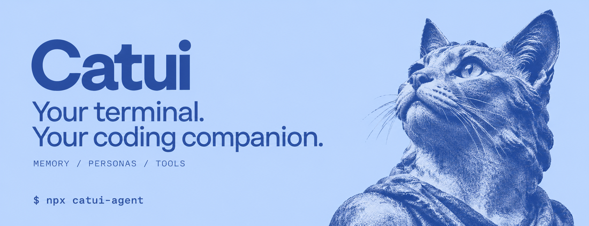

# Catui

[](https://github.com/O-Pencil/Catui/actions/workflows/ci.yml)
[](https://github.com/O-Pencil/Catui/actions/workflows/quality.yml)
[](https://www.npmjs.com/package/catui-agent)
[](LICENSE)
[](https://nodejs.org/)



A terminal-first AI coding agent with persistent project memory, selectable personas,
and extensible tools. Built with TypeScript and Node.js; published as `catui-agent`.

[中文](README_CN.md) · [日本語](README_JA.md) · [Русский](README_RU.md) · [SDK](docs/sdk.md)

## Start

Requires Node.js 20 or later.

```bash
npm install -g catui-agent
catui
```

Use `/login` to configure a provider, `/model` to select a model, and `/persona` to
choose an identity. Provider credentials can also come from environment variables;
see [Provider configuration](#providers) below. Model availability depends on the
configured provider and account. Supported integrations include Anthropic, OpenAI,
Google, Alibaba DashScope/Token Plan, and local Ollama setups.

```bash
catui -c                           # Continue the previous session
catui -r                           # Select a session to resume
catui -p "Explain this repository" # Run once and exit
catui --mode rpc                    # JSON-lines integration over stdio
catui --acp                         # Editor integration through ACP
catui --serve --host 127.0.0.1      # HTTP/WebSocket remote control
catui --help                        # Full CLI options
```

The terminal UI is the primary interface. The repository also includes a remote
server and a separate mobile web/Capacitor client; see [remote mode](docs/remote.md).
The root build does not build the mobile app.

## What ships

### Connect Codex to your current session

On macOS/Linux, enter `/bridge start` in Catui and confirm the first-use plugin
installation. Open a new Codex chat and ask it to connect to your Catui session.
There are no extension paths, keys or port numbers to copy. Use `/bridge status`
to check client contact, `/bridge setup` to retry installation, and `/bridge stop`
to disconnect. Requires an installed Codex version with plugin support.
Codex can discover the live command catalog, direct normal work and Grub/Goal,
review Plan requests and answer delegated questions. Commands without a remote
adapter and elevated permission approval remain local. Catui executes; Codex
checks the resulting state and evidence before accepting completion.
See [connection guide](extensions/optional/session-bridge/README.md).

### Included capabilities

- **Tools and sessions:** file inspection/editing, shell execution, model switching,
  streaming responses, session history, branching, compaction and HTML export.
- **Memory and persona:** NanoMem retains project knowledge and preferences;
  persona files define identity and working style. **NanoSoul is suspended**:
  no automatic initialization, personality injection or interaction learning.
  Existing Soul data is left untouched. Legacy SDK Soul options are ignored.
- **Extensibility:** built-in and user extensions register tools, commands and
  lifecycle hooks. MCP connects external tool servers; Browser Harness is opt-in.
- **Workflows:** engineering discipline skills, planning, subagents/teams, `/goal`,
  `/grub`, `/loop`, research and writing skills. Check `/resources` for loaded
  resources; availability also depends on mode and configuration.
- **Runtime controls:** tool policies, bounded recovery, execution traces and
  replay/evaluation tooling. See [run traces](docs/run-trace-and-replay.md).

## Default decision skills

The default `typesafe` extension ships two skills:

| Skill | Purpose |
| --- | --- |
| `agent-decision-loop` | Choose a useful next action, ground tool arguments in evidence, evaluate results, and change approach when progress stalls |
| `typesafe-ai` | Build TypeSafe System One integrations using typed judgments and current upstream documentation |

A short decision/tool/evaluation guide is appended to each user turn. Full skill
bodies load on demand via the Skill tool or `/skill:agent-decision-loop` and
`/skill:typesafe-ai`. This works across CLI modes and headless SDK prompts.

Ordinary Catui work uses the configured model and existing tools; it does not
require a TypeSafe account or add TypeSafe API calls. Building an actual TypeSafe
integration requires that service's credentials. Skill guidance is not a runtime
correctness guarantee or a measured reduction in model errors.

The upstream skill is vendored from [typesafe-ai/skills](https://github.com/typesafe-ai/skills)
at a pinned revision with its MIT license; see [provenance](extensions/builtin/typesafe/AGENT.md).
`--no-extensions` disables directory discovery. The CLI supplies built-in extensions
explicitly, so they remain loaded, as do explicit `-e` paths.

## Configuration and storage

By default, agent configuration lives under `~/.catui/agents/<id>/` (ID `default`):

| File/directory | Purpose |
| --- | --- |
| `auth.json` | Provider credentials |
| `models.json` | Custom model definitions |
| `settings.json` | Preferences and feature settings |
| `sessions/` | Saved conversations |
| `extensions/` | User extensions |

`--agent <id>` selects an agent; `CATUI_CODING_AGENT_DIR` overrides its config root.
See `/model` and `/persona` for inline configuration; `docs/sdk.md` documents
programmatic embedders.
Local persistence does not mean every feature is offline: configured providers,
MCP servers and enabled external integrations may make network requests.

## Develop

```bash
npm ci
npm run build
npx tsx cli.ts
```

The repository uses npm workspaces for three private runtime libraries and the
published protocol/memory integrations. `apps/mobile` has its own toolchain.
`packages/soul-core` is retained as suspended standalone source, outside the root
workspace and application build.

| Location | Responsibility |
| --- | --- |
| `cli.ts`, `main.ts` | CLI startup and mode selection |
| `core/runtime/` | Shared session facade and focused runtime owners |
| `core/lib/{ai,agent-core,tui}/` | Private model, execution-loop and terminal libraries |
| `core/platform/` | Configuration, process and utility primitives |
| `modes/` | Interactive, print, RPC, ACP and remote interfaces |
| `extensions/` | Default and opt-in product capabilities |
| `packages/{protocol,mem-core}/` | Published protocol and memory integrations |
| `test/`, `tests/` | Regression and characterization tests |
| `.dev-docs/`, `llm-wiki/` | Architecture decisions and generated code navigation |

`AgentSession` preserves the public facade. Model changes, lifecycle, compaction,
queued messages, event ordering, trace persistence, statistics and resource
discovery have named owners; start with [the runtime map](core/runtime/AGENT.md).

Before changing behavior, follow [AGENTS.md](AGENTS.md) and the
[feature workflow](.dev-docs/feature-workflow.md). Required checks:

```bash
npm run verify:dip
npm run verify:quality
npm run verify:package-boundary
npm run build
npx tsc --noEmit
npm test
```

Focused scripts are listed in `package.json`. Optional integration checks may
need provider credentials or additional services. Build and publish are separate;
see [contribution guidance](CONTRIBUTING.md) before releasing.

## License

[GPL-3.0](LICENSE). Vendored components retain their own license notices.
