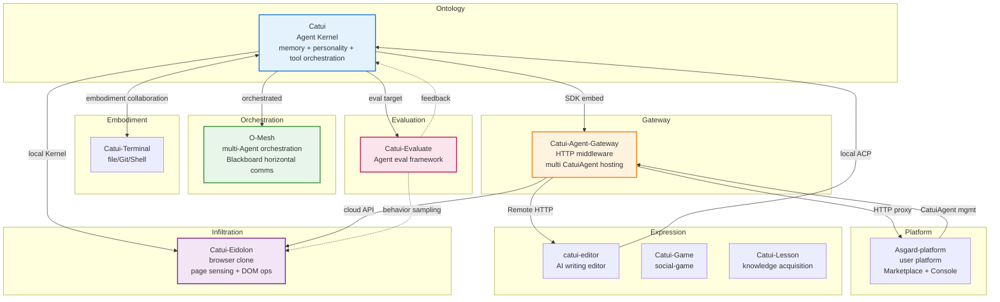

# §3 Project Relationships

> Complete matrix of dependencies, calls, and collaboration between projects

<!--
[WHO]  Inter-project relationship definitions
[FROM] agent-projects-relations.md + PROJECT_OVERVIEW.md §七 + catui-platform-charter.md
[TO]   Each project's integration docs, architecture design
[HERE] charter/03-relations.md — relationships
-->

---

## 3.1 Core dependency chain

```
O-Mesh (orchestration) → Catui (execution) → Catui-Evaluate (evaluation) → feedback to optimize
Catui-Eidolon (browser host) ← Catui (local Kernel) / Gateway (cloud API)
```

## 3.2 Relationship matrix

| Source | Target | Relation type | Description |
|--------|--------|---------------|-------------|
| Asgard-platform | Catui-Agent-Gateway | Service consumer | Calls via OpenAI-compatible API |
| Asgard-platform | Catui | Instance manager | Configures and manages multiple CatuiAgent instances |
| Catui | Catui-Agent-Gateway | SDK embed | `@catui/agent` is imported by Gateway |
| Catui | O-Mesh | Orchestrated node | Acts as an Agent node scheduled by O-Mesh |
| Catui | Catui-Evaluate | Evaluation target | Quantitative evaluation of Agent capabilities |
| Catui | Catui-Terminal | Embodiment collaboration | Terminal provides physical-world operations |
| O-Mesh | Catui-Agent-Gateway | Task dispatch | Distributes decomposed complex tasks via gateway |
| Catui-Evaluate | Catui | Feedback-driven optimization | Evaluation results drive ontology evolution |
| Catui-Eidolon | Catui | Local Kernel consumer | Native Messaging / ACP calls |
| Catui-Eidolon | Catui-Agent-Gateway | Cloud API consumer | OpenAI-compatible API calls |
| Catui-Eidolon | Catui-Terminal | Capability complementarity | Browser DOM + local Shell = complete embodiment |
| Catui-Eidolon | Catui-Evaluate | Behavior sampling | Agent performance evaluation in browser scenarios |
| catui-editor | Catui | ACP call | Local mode: direct ACP to CLI |
| catui-editor | Catui-Agent-Gateway | HTTP call | Remote mode: via OpenAI API |
| Catui-Game | Catui / Gateway | Agent integration | AI characters in games go through Gateway |
| Catui-Lesson | Catui / Gateway | Agent integration | AI tutoring in learning scenarios |

## 3.3 Relationship diagram



## 3.4 Key collaboration patterns

### Pattern A — Single-Agent deep task

```
User → Catui CLI → coding implementation → Catui-Evaluate eval → feedback to optimize
```

### Pattern B — Multi-Agent collaborative development

```
User → O-Mesh Orchestrator
    ├──→ Node1 (Catui): design DB schema
    ├──→ Node2 (Catui): implement API endpoints (depends on Node1)
    ├──→ Node3 (Catui): write unit tests
    └──→ Node4 (catui-editor): write API docs
    ↓
Blackboard shares schema definition
    ↓
Catui-Evaluate evaluates each node's output
```

### Pattern C — Browser infiltration interaction

```
User opens Eidolon Side Panel on any web page
    ↓
Eidolon reads current page DOM context
    ↓
Local mode: Native Messaging → Catui (memory + reasoning)
Cloud mode: OpenAI-compatible API → Gateway → CatuiAgent
    ↓
Returns reasoning result or page-action intent
    ↓
Eidolon executes DOM action under per-origin permission, Side Panel reports result
```

### Pattern D — Platform-as-a-Service

```
User → Asgard Marketplace → select / create CatuiAgent
    ↓
Asgard → Gateway creates instance (catui-agent SDK + Soul + Memory)
    ↓
User chats with CatuiAgent via Chat / Console
    ↓
Asgard records usage / billing
```

## 3.5 Technical integration points

| Integration | Interface / Protocol | Description |
|-------------|---------------------|-------------|
| Catui ↔ Gateway | SDK import | Gateway imports `@catui/agent` |
| Catui ↔ O-Mesh | CLI / Stream JSON | O-Mesh Runner calls Catui CLI |
| Catui ↔ Catui-Evaluate | Python SDK | Evaluate calls Catui to run tests |
| Catui ↔ Eidolon | Native Messaging / ACP | Browser extension calls Catui as local Brain |
| Catui ↔ Browser Harness | CDP / Python CLI | Generic browser tooling (non-Eidolon scenarios) |
| Gateway ↔ Asgard | HTTP proxy | Asgard routes to Gateway via HTTP |
| Gateway ↔ Editor | HTTP + SSE (OpenAI-compatible) | Remote-mode standard API |
| Gateway ↔ Eidolon | HTTP + SSE (OpenAI-compatible) | Cloud-mode standard API |
| Gateway ↔ Channel | DingTalk Stream / WeChat XML / Feishu events | IM integration |
| Cross-project communication | Blackboard (KV + pub/sub) | O-Mesh-provided horizontal-comms mechanism |
