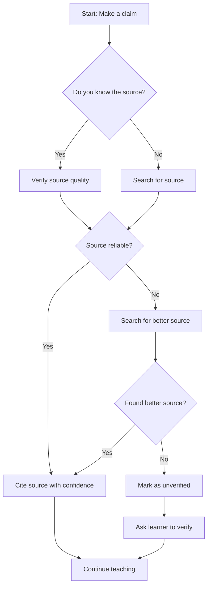

# Source Verification Rules

Every factual claim in teaching must have a verifiable source.
This ensures accuracy and builds learner trust.

---

## Source Hierarchy

| Level | Source Type | Confidence | Example |
|-------|------------|------------|---------|
| 1 | Official documentation | ⭐⭐⭐⭐⭐ | Official guides, documentation |
| 1 | Peer-reviewed papers | ⭐⭐⭐⭐⭐ | Academic papers, research reports |
| 1 | Government/regulatory sources | ⭐⭐⭐⭐⭐ | Official statistics, regulatory documents |
| 2 | Recognized industry experts | ⭐⭐⭐⭐ | Well-known experts, industry leaders |
| 2 | Established educational institutions | ⭐⭐⭐⭐ | Universities, research institutions |
| 2 | Well-known publications | ⭐⭐⭐⭐ | Authoritative media, professional journals |
| 3 | Community sources (high-voted) | ⭐⭐⭐ | Stack Overflow, Reddit high-vote answers |
| 3 | Open source projects | ⭐⭐⭐ | GitHub projects, official examples |
| 4 | Blog posts, tutorials | ⭐⭐ | Personal blogs, tutorial websites |
| 5 | User-generated content | ⭐ | Forum posts, comments |

---

## Citation Format

Every factual claim must include:

```markdown
**Claim**: [Claim being made]
**Source**: [Source Name](URL)
**Confidence**: ⭐⭐⭐⭐⭐ (Reason for this confidence level)
**Verification method**: [How this was verified - web search, official docs, user confirmation]
```

### Example

```markdown
**Claim**: Pasta should be cooked in salted water
**Source**: [Barilla Official Guide](https://www.barilla.com/en-us/help/cooking-pasta)
**Confidence**: ⭐⭐⭐⭐⭐ (Official authoritative source)
**Verification method**: Official documentation confirmed
```

---

## When Source is Unavailable

If no reliable source can be found:

1. **Use web search** to verify the claim
2. **Ask the learner** to confirm if they have prior knowledge
3. **Mark as unverified**:

```markdown
**Claim**: [Claim]
**Source**: No reliable source available
**Confidence**: ⭐ (Pending verification)
**Verification method**: Requires user confirmation or further search
```

---

## Source Verification Process

Before stating a fact:

1. **Check if you know the source** (official docs, established knowledge)
2. **If uncertain**, use web search to verify
3. **If still uncertain**, ask the learner:
   - "I need to verify this claim. Have you seen this information elsewhere?"
   - "Let me search for the latest information to confirm"
4. **If no source found**, mark as unverified and suggest the learner verify independently

---

## Red Flags

Never use these as primary sources:

- ❌ Unverified social media posts
- ❌ Anonymous forum answers without citations
- ❌ Outdated information (>2 years for fast-moving topics)
- ❌ Marketing materials disguised as education
- ❌ Personal opinions presented as facts

---

## Special Cases

### Historical Facts
- Use official records, academic sources
- Mark confidence based on source reliability

### Technical Skills
- Use official documentation, established tutorials
- Prefer hands-on examples over theoretical explanations

### Personal Preferences
- No source needed for subjective topics
- Clearly mark as "preference" not "fact"

### Controversial Topics
- Present multiple perspectives
- Cite sources for each perspective
- Let the learner form their own opinion

---

## Confidence Levels Explained

### ⭐⭐⭐⭐⭐ (Very High Confidence)
- Official documentation from the source
- Peer-reviewed academic papers
- Government/regulatory documents
- Well-established facts

**When to use**: When the source is authoritative and the information is well-documented.

### ⭐⭐⭐⭐ (High Confidence)
- Recognized industry experts
- Established educational institutions
- Well-known professional publications
- Widely accepted best practices

**When to use**: When the source is reputable but not the primary authority.

### ⭐⭐⭐ (Medium Confidence)
- Community sources with high votes/engagement
- Open source projects with active maintenance
- Multiple corroborating sources
- Established conventions

**When to use**: When information comes from community consensus.

### ⭐⭐ (Low Confidence)
- Personal blogs without citations
- Tutorial websites without author credentials
- Outdated information
- Single-source claims

**When to use**: When no better source exists, with appropriate caveats.

### ⭐ (Very Low Confidence)
- Unverified user-generated content
- Anonymous sources
- Conflicting information
- Speculation

**When to use**: Only when explicitly marked as unverified, with recommendation to verify.

---

## Source Quality Checklist

Before citing a source, verify:

- [ ] **Authority**: Is the source authoritative on this topic?
- [ ] **Accuracy**: Is the information accurate and verifiable?
- [ ] **Currency**: Is the information up-to-date?
- [ ] **Coverage**: Does it cover the topic adequately?
- [ ] **Objectivity**: Is it unbiased and objective?

---

## Handling Conflicting Sources

When sources conflict:

1. **Present both perspectives** with their sources
2. **Note the conflict** explicitly
3. **Recommend verification** by the learner
4. **Explain why** one source might be more reliable

Example:
```markdown
**Note**: There are different perspectives on this:

**View A**: [Source A](url) suggests X
**View B**: [Source B](url) suggests Y

The conflict arises because [reason]. For your use case, [recommendation].
```

---

## Source Verification Tools

When available, use these tools to verify sources:

1. **Web search**: Search for the claim to find corroborating sources
2. **Official documentation**: Check the official docs for the topic
3. **Expert opinions**: Look for recognized experts in the field
4. **Community consensus**: Check Stack Overflow, Reddit, etc.
5. **Academic sources**: For scientific claims, check peer-reviewed papers

---

## Example Source Citations

### Technology Topic
```markdown
**Claim**: React uses a virtual DOM for performance
**Source**: [React Official Documentation](https://reactjs.org/docs/faq-internals.html)
**Confidence**: ⭐⭐⭐⭐⭐ (Official documentation)
**Verification method**: Direct from React team
```

### Cooking Topic
```markdown
**Claim**: Salt raises the boiling point of water
**Source**: [Serious Eats](https://www.seriouseats.com/2014/10/does-salt-make-water-boil-faster.html)
**Confidence**: ⭐⭐⭐⭐ (Reputable food science source)
**Verification method**: Food science explanation with citations
```

### Business Topic
```markdown
**Claim**: Agile methodology improves project success rates
**Source**: [PMI Pulse of the Profession](https://www.pmi.org/learning/library)
**Confidence**: ⭐⭐⭐⭐ (Professional organization research)
**Verification method**: Industry research report
```

---

## Teaching with Sources

When teaching, integrate sources naturally:

1. **State the fact**: "Pasta should be cooked al dente"
2. **Provide the source**: "According to Barilla's official guide..."
3. **Explain the confidence**: "This is a high-confidence source because..."
4. **Encourage verification**: "You can verify this yourself by..."

This builds trust and teaches critical thinking.

---

## Source Verification Workflow



---

## Maintaining Source Quality

Over time:

1. **Update sources** when better ones become available
2. **Remove outdated** sources
3. **Add new sources** as you learn more
4. **Track source quality** to improve future citations
